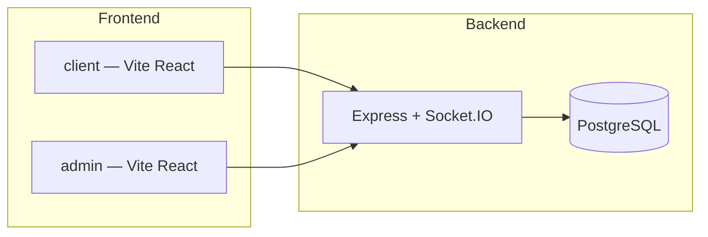
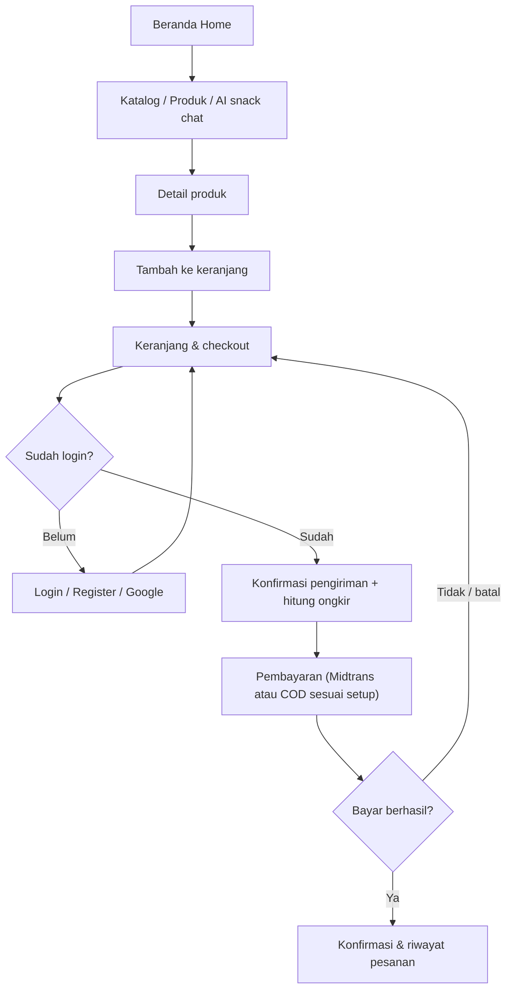
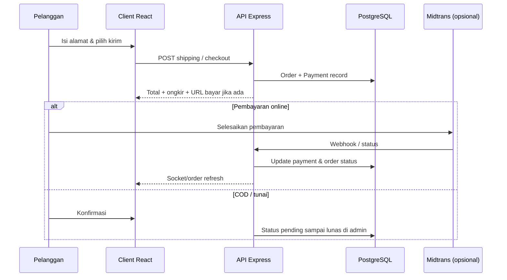
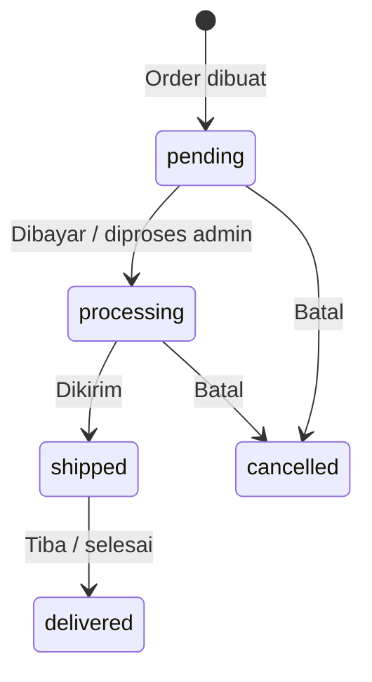
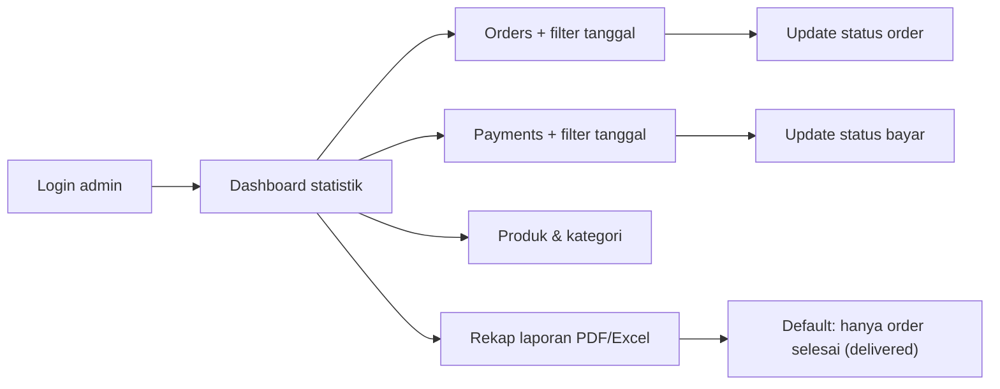
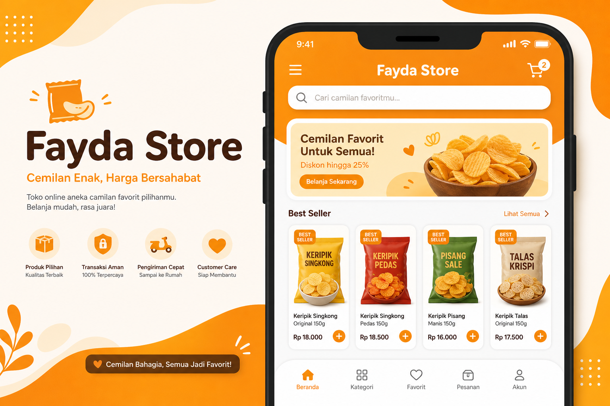
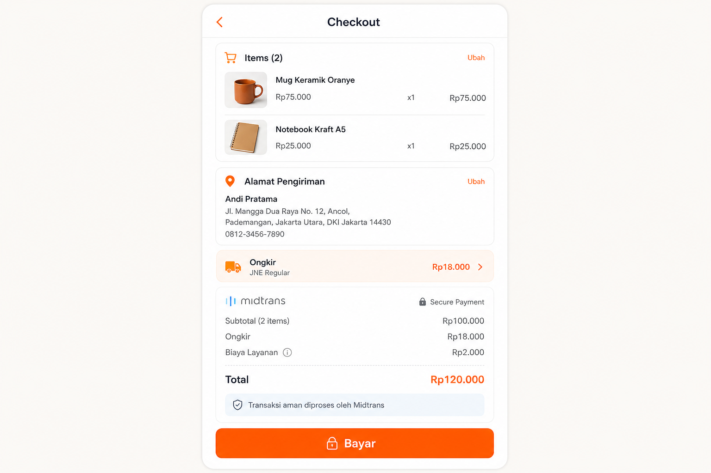
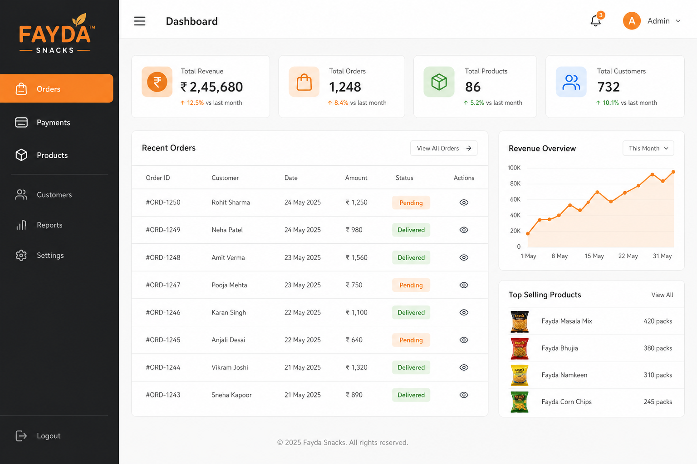

# Fayda Store

Platform e-commerce snack dengan **toko pelanggan** (`client`), **panel admin** (`admin`), dan **API** (`server`): katalog, keranjang, checkout, ongkir, pembayaran (Midtrans), notifikasi real-time (Socket.IO), serta bantuan pencarian produk dengan AI (Google Gemini).

---

## Arsitektur



| Lapisan | Teknologi |
|--------|-----------|
| Toko pelanggan | React 19, Vite 7, Tailwind 4, Redux Toolkit, React Router, Axios, Socket.IO client |
| Admin | React 19, Vite, Tailwind, jsPDF / SheetJS (Excel), Socket.IO client |
| API | Express 5, Sequelize 6, PostgreSQL, JWT, Cloudinary, Midtrans, Socket.IO |
| Lainnya | Google OAuth, Gemini AI, OpenRouteService (ongkir), Nodemailer (SMTP) |

---

## Alur utama

Berikut rangkuman alur **bisnis** dan **alur data** utama. Digambar dengan Mermaid (tampilan otomatis di GitHub dan banyak preview Markdown).

### Alur belanja pelanggan (high level)



### Alur dari sisi sistem (checkout → order)



### Siklus status order (contoh bisnis umum di aplikasi ini)



### Alur ringkas admin monitoring



---

## Cuplikan tampilan (ilustrasi)

Gambar di bawah adalah **mockup ilustratif** untuk README (bukan screenshot piksel dari build). Untuk dokumentasi dengan screenshot **asli** dari browser, simpan PNG di folder ini dan tautkan dari sini atau ganti nama file dengan gambar baru.

| Client — beranda & katalog (konsep) | Client — checkout / bayar (konsep) |
|:---:|:---:|
|  |  |

| Admin — dashboard pesanan / statistik (konsep) |
|:---:|
|  |

**Halaman nyata yang lebih lengkap di codebase (client)** antara lain: `Home`, `Produk`, `DetailProduct`, `Checkout`, `ConfirmDelivery`, `Payment`, login/akun, chat AI snack. **Admin**: `Dashboard`, `Orders`, `Payments`, kelola produk/kategori/users, `RecapReport` (rekap PDF/Excel).

---

## Struktur repositori

```
fayda-store/
├── client/          # Aplikasi toko (pelanggan)
├── admin/           # Dashboard admin
├── docs/readme/     # Aset dokumentasi README (gambar mockup)
├── server/          # REST API + socket
│   ├── bin/www      # Entry server (HTTP + Socket.IO)
│   ├── models/      # Sequelize models
│   ├── migrations/  # Migrasi DB
│   ├── routers/     # Route Express
│   └── controllers/
└── README.md
```

---

## Prasyarat

- **Node.js** (disarankan LTS)
- **PostgreSQL**
- Akun opsional: **Cloudinary**, **Midtrans**, **Google Cloud / OAuth**, **Gemini API**, **SMTP**, **OpenRouteService** (sesuai fitur yang diaktifkan)

---

## Menjalankan secara lokal

### 1. Database

Buat database PostgreSQL (nama bisa mengikuti `server/config/config.json`, mis. `faydaStore`), lalu jalankan migrasi dari folder `server`:

```bash
cd server
npx sequelize-cli db:migrate
```

Opsional:

```bash
npx sequelize-cli db:seed:all
```

### 2. Server API

```bash
cd server
cp .env-example .env
npm install
npx nodemon bin/www
```

Tanpa nodemon:

```bash
node bin/www
```

Server mendengarkan **`PORT`** dari environment (default **3000**).

### 3. Client (toko)

```bash
cd client
npm install
npm run dev
```

Sesuaikan **`client/src/constant/Url.jsx`** agar `baseURL` API mengarah ke server lokal jika tidak memakai production API.

### 4. Admin

```bash
cd admin
npm install
npm run dev
```

Sesuaikan **`admin/src/constant/Url.jsx`** sama seperti client.

---

## Build production

```bash
cd client && npm run build
cd admin && npm run build
```

Output biasanya di folder `dist/` masing-masing (mis. untuk hosting statis / Firebase Hosting).

---

## Environment variables (server)

File konfigurasi: **`server/.env`** (non-production memuat dotenv di `app.js`).

| Variabel | Keterangan |
|----------|------------|
| `PORT` | Port HTTP (default `3000`) |
| `DATABASE_URL` | Production DB (lihat `config/config.json`) |
| `JWT_SECRET` atau `SECRET_KEY` | Secret JWT |
| `CLIENT_URL` | Origin yang diizinkan CORS (pisahkan dengan koma jika banyak) |
| `GOOGLE_CLIENT_ID` | Verifikasi Google Sign-In |
| `SECRET_NAME_CLOUD`, `SECRET_KEY_CLOUD`, `SECRET_API_CLOUD` | Cloudinary |
| `MIDTRANS_SERVER_KEY` | Pembayaran Midtrans |
| `GEMINI_API_KEY` | Fitur AI produk |
| `STORE_LAT`, `STORE_LNG`, `ORS_API_KEY`, `MAX_DELIVERY_DISTANCE_KM` | Perhitungan ongkir |
| `SMTP_*`, `SMTP_FROM`, `APP_NAME`, `SUPPORT_EMAIL` | Email (reset password, dll.) |
| `TELEGRAM_BOT_TOKEN`, `TELEGRAM_ADMIN_CHAT_ID` | Notifikasi Telegram (opsional) |

### SMTP (reset password)

Tambahkan di `server/.env` agar token reset password bisa dikirim via email:

```env
SMTP_HOST=smtp.gmail.com
SMTP_PORT=587
SMTP_SECURE=false
SMTP_USER=your_email@gmail.com
SMTP_PASS=your_app_password
SMTP_FROM="Fayda Store <your_email@gmail.com>"
```

- Untuk Gmail, gunakan **App Password** (bukan password akun utama).
- Setelah setup, endpoint `/auth/forgot-password` dapat mengirim token reset ke email user.

---

## Environment variables (frontend)

Variabel **`VITE_*`** ditanam saat build (Vite).

| Variabel | Dipakai di |
|----------|------------|
| `VITE_GOOGLE_CLIENT_ID` | Login Google (`client` / `admin`) |
| `VITE_ADMIN_DASHBOARD_URL` | Tautan ke admin dari client (`Login.jsx`) |
| `VITE_CLIENT_LOGIN_URL`, `VITE_CLIENT_LOGOUT_URL` | Admin → redirect login/logout pelanggan |
| `VITE_MAX_DELIVERY_DISTANCE_KM` | Batas jarak kirim di UI (`ConfirmDelivery.jsx`) |

---

## Fitur utama

- **Pelanggan:** katalog, detail produk, keranjang, checkout, konfirmasi alamat & ongkir, pembayaran, rating, chat AI rekomendasi produk.
- **Admin:** produk & kategori, user, order & pembayaran (filter tanggal), dashboard statistik, rekap laporan (per hari/bulan/tahun, ekspor PDF/Excel, opsi order selesai vs semua status), real-time via socket.

Prefix route mengikuti `server/routers/` (mis. `/pub`, `/auth`, `/admin`, `/shipping`, `/ai`, serta route pembayaran).

---

## CORS & production

Origin default di `server/app.js` mencakup domain production; tambahkan origin development atau staging lewat **`CLIENT_URL`** (dipisah koma).

---

## Pengujian server

```bash
cd server
npm test
```

---

## Lisensi

ISC (sesuai `server/package.json`). Sesuaikan jika proyek memakai lisensi lain.
